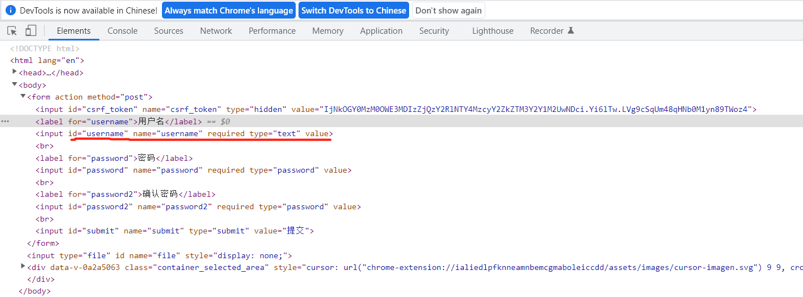

# 1.static
包，而不是普通文件夹。程序中使用静态资源不用加static路径，直接引用其下的文件
# 2.template
模板文件夹的生成方式是右键文件夹->mark d as-> template f,然后再选择一种模板引擎比如jinjia2
# 3.flask模板

以第一个StringField来说，变量名username实际上就作为这个文本框的名称，label名用来生成与这个文本框匹配的label，
所以当前端提交表单POST来的数据，各个key就是flask中构造对象的变量名，form对象的各个变量值被更新(应该就是通过名称来对应)，
所以后面可以通过form对象取得POST来的值，当然，也可以使用常规的request来获取

# 4.debug模式
Flask应用可以在调试模式中运行。 在这个模式下，开发服务器默认会加载两个便利的工具：重载器和调试器。启用重载器后，
Flask会监视项目中的所有源码文件，发现变动时自动重启服务器。在开发过程中运行启动重载器的服务器特别方便，因为每次
修改并保存源码文件后，服务器都会自动重启，让改动生效。调试器是一个基于Web的工具，**当应用抛出未处理的异常时**，
它会出现在浏览器中。此时，Web浏览器变成一个交互式栈跟踪，你可以在里面审查源码，在调用栈的任何位置计算表达式。
**设置方式:**命令行以flask run的方式运行时(设定环境变量FLASK_APP=test.py,即要运行的脚本文件)，环境变量中需设定
FLASK DEBUG=1；通过app.run()运行时指定参数debug=True
# 5.请求钩子
请求钩子的两种设定方式。1.装饰器方式,例如@app.before_request 2. app.before_request(定义的函数)。
在请求钩子函数和视图函数之间共享数据一般使用上下文全局变量g。例如，before request处理程序可以从数据库
中加载已登录用户，并将其保存到g.user中。随后调用视图函数时，便可以通过g.user获取用户。
# 6.safe过滤器
safe过滤器值得特别说明一下。默认情况下，出于安全考虑，Jinja2会转义所有变量。例如，如果一个变量的
值为'<h1>Hello</h1>', Jinja2会将其渲染成’&lt;h1&gt; Hello&lt; /h1&gt; '，浏览器能显示这个h1元素，
但不会解释它。很多情况下需要显示变量中存储的HTML代码，这时就可使用safe过滤器。
# 7.宏macro
可以使用定义在本文件中中的宏，也可以从其他文件中导入宏；宏可以被定义在HTML文件的任何地方；宏的定义和使用与函数很像
# 8.include
include的作用是把一个HTML文件在另一个中直接复用
# 9.extends
extends的一般用法是定义一个基模版base，在基模板中留出block，在继承其的模块中直接往block里面填充内容即可。也就是说
继承base的HTML模板可以完全是空的，只在里面写上各个block的内容即可。如果基模板和衍生模板中的同名区块中都有内容，
衍生模板中的内容将显示出来。在衍生模板的区块里可以调用{{super()}}，引用基模板中同名区块里的内容。

