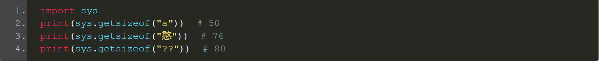
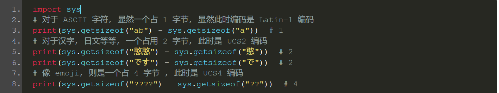

参考链接：https://www.h3399.cn/202008/778954.html
首先 Python 中的字符串是一个变长对象, 因为不同长度的字符串所占的内存空间是不一样的; 但同时字符串又是一个不可变对象, 因为一旦创建就不可以再修改了
而 Python 中的字符串是通过 unicode 来表示的, 因此在底层对应的结构体是 PyUnicodeObject. 但是为什么需要 unicode 呢?

首先计算机存储的基本单位是字节, 由 8 个比特位组成, 由于英文字母算上大小写只有 52 个, 再加上若干字符, 数量不会超过 256 个, 因此一个字节完全可以表示, 这些字符称之为 ASCII 字符. 但是随着非英文字符的出现, 导致一个字节已经无法表示了, 只能曲线救国, 对于一个字节无法表示的字符, 使用多个字节表示.

但是这样会出现两个问题:

不支持多国语言, 例如中文的编码不可以包含日文;

没有统一标准, 例如中文有 GB2312,GBK,GB18030 等多个标准;

所以由于编码不统一, 开发人员经常在不同的编码间来回转换, 会错误频出. 为了彻底解决这个问题, unicode 标准诞生了. unicode 对世界上的文字系统进行了系统的整理, 编码, 让计算机可以用统一的方式处理文本, 而且目前已经支持超过 13 万个字符, 天然地支持多国语言.

但是问题来了, unicode 能表示这么多的字符, 那么占用的内存一定不低吧. 是的, 根据当时的编码, 一个 unicode 字符最高会占用到 4 字节. 但是对于西方人来说, 明明一个字符就够用了, 为啥需要那么多. 于是又出现了 utf-8, 它是为 unicode 提供的新一个新的编码规则, 具有可变长的功能. 对于 1 个 ASCII 字符那么会使用一个字节存储, 对于非 ASCII 字符会使用 3 个字节存储.

但 Python3 中表示 unicode 字符串时, 使用的却不是 utf-8, 至于原因我们下面来分析一下. 国外有一篇文章, 题目翻译过来说的是 "Python 在存储字符串的时候如何节省内存", 写的非常好, 我们来看看.

Python 在存储字符串的时候如何节省内存

从 Python3 开始, str 类型使用的是 Unicode. 而根据编码的不同, Unicode 的每个字符最大可以占到 4 字节, 从内存的角度来说, 这种编码有时会比较昂贵.

为了减少内存消耗并且提高性能, python 的内部使用了三种编码方式表示 Unicode.

Latin-1 编码: 每个字符一字节;

UCS2 编码: 每个字符两字节;

UCS4 编码: 每个字符四字节;

在 Python 编程中, 所有字符串的行为都是一致的, 而且大多数时间我们都没有注意到差异. 然而在处理大文本的时候, 这种差异就会变得异常显著, 甚至有些让人出乎意料.

为了看到内部表示的差异, 我们使用 sys.getsizeof 函数, 返回一个对象所占的字节数:

我们看到都是一个字符, 但是它们占用的内存却是不一样的.

正如你所见, Python 面对不同的字符会采用不同的编码. 需要注意的是, Python 中的每一个字符串都需要额外占用 49-80 字节, 因为要存储一些额外信息, 比如: 哈希, 长度, 字节长度, 编码类型等等.

而采用不同的编码, 那么底层结构体实例额外的部分也会占用不同大小的内存. 如果编码是 Latin-1, 那么这个结构体实例额外的部分会占 49 个字阶; 编码是 UCS2, 占 74 个字节; 编码是 UCS4, 占 76 个字节. 然后字符串所占的字节数就等于: 额外的部分 + 字符个数 * 单个字符所占的字节.
因此 Python 才会提供了三种编码, 先使用占用最小的 Latin1, 不行的话再使用 UCS2,UCS4, 总之会确保每个字符占用的字节是一样的, 原因的话我们上面分析的很透彻了. 并且无论是索引还是切片, 还是计算长度等等, 都是基于字符的, 显然这也符合人类的思维习惯